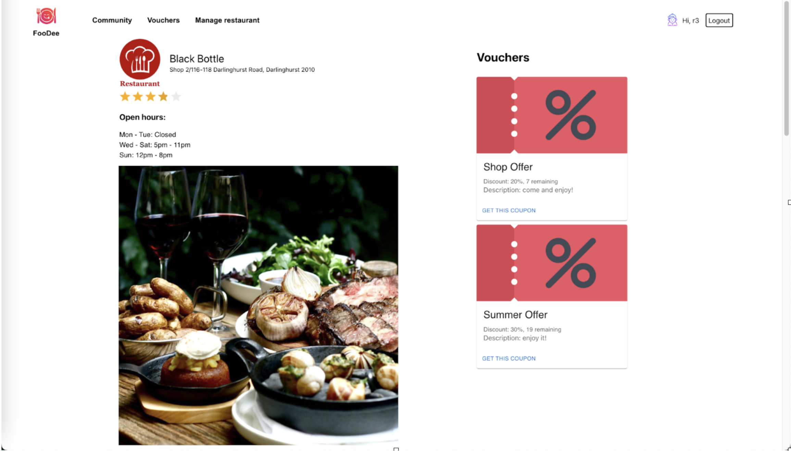

# Final Year Project

Note: Here, I have removed the frontend components, and only included the backend (parts that I have worked on) due to plagiarism.

  

## Special notes for backend:

- ### Back-end setup (Python, FlaskAPI, SQLlite)

Here is the database architecture, implemented with a cloud database.

  

- ### Recommender System (Item-based collaborative filtering)

The aim of the recommendation system was to automatically recommend restaurants to users that they have never been to that they would likely like.

The implementation of the recommendation system was challenging since there were many new concepts and equations that required understanding, as well as trying to manipulate our own database to fit into the equation.

The recommendation system was designed on the Item-based collaborative filtering model, with the Peason’s Coefficient Correlation Method, with the number of minimum restaurants set to 2. This was chosen as it removes any offsets given the ratings, also since it is the most popular method for similar applications.

Firstly, the model required a matrix of p x p dimensions (where p is the number of restaurants). The matrix would represent a similarity matrix, giving a similarity score (between -1 and 1) for each restaurant. The similarity score would be based on the ratings given by the users to the restaurant.

  

  

Then with this similarity matrix, we were able to calculate and predict the score with this formula

  

  

The final result :

  

## Website other pages preview:

Login/register page :

  

Restaurant Page:

  

Profile Page:

  

Community Page:

